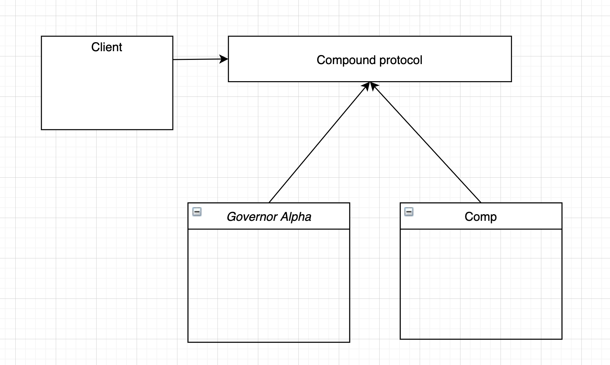
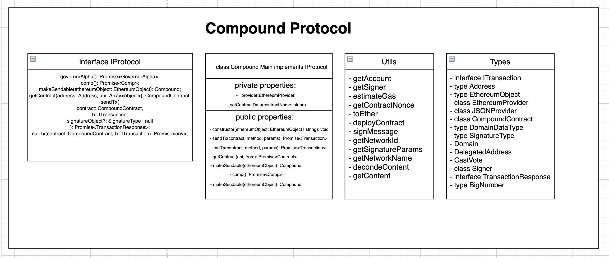
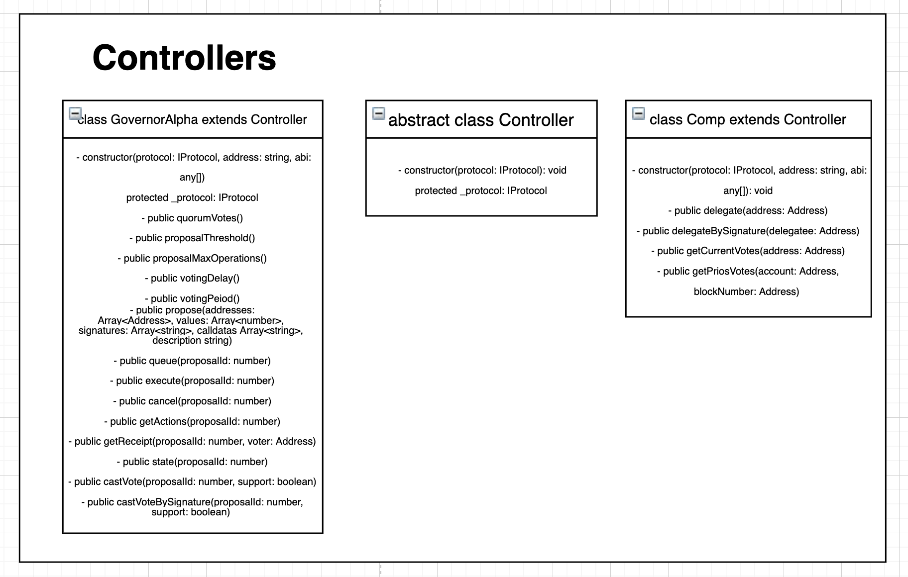

[](https://travis-ci.com/dOrgTech/compound-sdk)

# Compound SDK

NodeJS Library to interact with the Compound Governance ecosystem, specifically with the Governor Alpha and Comp contracts.

This SDK makes it easier to develop new tools on top of the Compound protocol by allowing developers to just focus on the UI.

## Architecture

The SDK is composed of the protocol wrapper, Governor Alpha, and Comp implementation.

<p float="center">
  
</p>

The UI will talk directly with the wrapper of the procotol, which is based on the [Ether.js](https://github.com/ethers-io/ethers.js/) library, making it super light weight and mobile friendly.

The architecture of this wrapper is the following:

<p float="center">
  
</p>

First, we apply the IoC principle by making the Main class dependent of an interface. This way, if this class is changed, its dependent class won't be changed.

**Main class** contains the SDK's core functionalities: `getContract`, `callTx` and `sendTx`. It can also retrieve info from contracts dynamically, making a request to the [Compound repository](https://github.com/compound-finance/compound-protocol/tree/master/networks). This way, the latest ABI and address are retrieved and the library keeps up-to-date without the need to change the code.

**Utils file** allows the developer to use every method of the Ether.js library in any way.

**Types file** is the only piece that interacts directly with Ether.js. This faciliates the debuging/change of the library regarding the interaction with blockchain modules.


Lastly, the **controllers modules** allow the developer to interact with the Governor Alpha and Comp contracts:

<p float="center">
  
</p>

The developer can interact with every method of the contract once the SDK has been initalized with the expected params.

## Usage

First of all, make sure you have node version `>= 10.16.3` installed.
Then, do:

`npm i --save compound-sdk`

Now you can utilize the SDK in your Javascript App:

```
import Compound from 'compound-sdk'
```

There are two ways to initialize your SDK:

1. By passing a node URL (but you wont be able to send transactions / write to the blockchain)

2. By passing the web3provider object (i.e: Metamask)

This way, developers can pass a URL to read the blockchain and only ask the the user to log-in with a web3 wallet when they need to trigger a tx. For example, at first you just pass the URL:

```
const sdk = new Compound("http://mainnet.infura.io/v3/your_api)
// we create instance of Comp Contract
const comp = await sdk.comp()
const currentVotes = comp.getCurrentVotes('0xProposalAddress')
```

Trying to call a [Non-Constant](https://docs.ethers.io/ethers.js/html/api-contract.html#contract-methods) method will throw an error if you have not initialized the SDK with a provider. You can make the SDK write to the blockchain by calling the following method:

```
sdk.makeSendable(web3provider) // make sure you send the currentProvider or it might fail
```

After setting up a web3provider, you can trigger call and send methods - please check [the official documentation of the Compound Governance contracts](https://compound.finance/docs/governance) to understand the methods.


