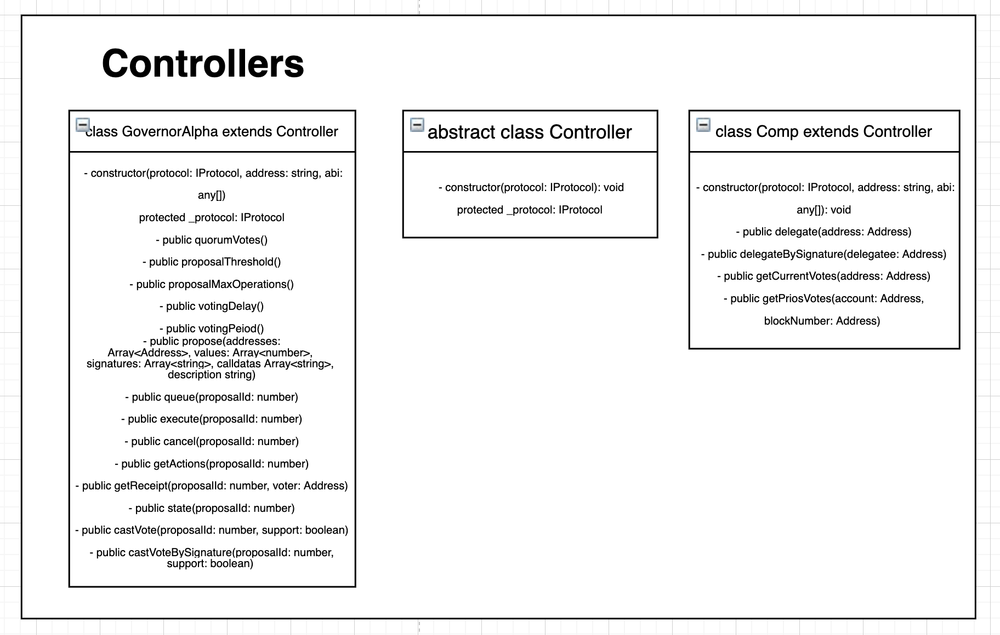

## Architecture

The SDK is composed of three main components: The Compound Protocol, Governor Alpha, and Comp.

  

The UI will talk directly with the wrapper of the procotol, which is based on the [Ether.js](https://github.com/ethers-io/ethers.js/) library, making it super light weight and mobile friendly.

The architecture of this wrapper is the following:

  

First, we apply the IoC principle by making the Main class dependent of an interface. This way, if this class is changed, its dependent class won't be changed.

**Main class** contains the SDK's core functionalities, it's the one that interacts directly with the blockchain (Like sending tx).

It also retrieves info from contracts, making a request to the [Compound repository](https://github.com/compound-finance/compound-protocol/tree/master/networks). - Note: Right now it's calling the master branch of the repository, but it can be improved to call a tag version so when the master branch is changed, it doesn't break the code

Lastly, the **controllers modules** allow the developer to interact with the Governor Alpha and Comp contracts:

  

The developer can interact with every method of the contract once the SDK has been initalized with the expected params.
